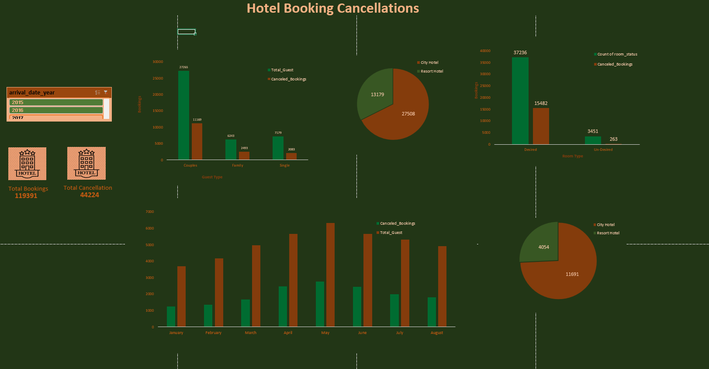

# 🏨 Hotel Booking Cancellations Dashboard

This project provides a comprehensive analysis of hotel booking trends and cancellation behavior using Power BI and Excel. The dashboard helps identify key patterns by guest type, hotel type, room preference, and monthly trends across the years 2015 to 2017.

---

## 📷 Dashboard Preview

---

## 📁 Files Included

| File Name                   | Description                                              |
|----------------------------|----------------------------------------------------------|
| `Dashboard.png`            | Power BI dashboard image showing key metrics             |
| `Pivot_Table.png`          | Snapshot of Excel pivot tables with summarized data      |
| `hotel_bookings_dataset.csv` | Raw dataset used for analysis (hotel bookings)        |

---

## 🎯 Project Objective

To analyze hotel booking data and uncover insights related to:
- Booking cancellations by guest and hotel type
- Impact of room preference on cancellations
- Monthly cancellation and guest trends
- Total booking vs cancellation volume

---

## 📊 Dashboard Highlights

### 📌 Summary Cards
- **Total Bookings**: `119,391`
- **Total Cancellations**: `44,224`

---

### 👥 Cancellations by Guest Type

| Guest Type | Total Guests | Cancelled Bookings |
|------------|--------------|---------------------|
| Couples    | 27,265       | 11,169              |
| Family     | 6,243        | 2,493               |
| Single     | 7,179        | 2,083               |

> ✅ *Couples had the highest number of bookings and cancellations.*

---

### 🏨 Cancellations by Hotel Type

| Hotel Type   | Total Bookings | Cancelled Bookings |
|--------------|----------------|--------------------|
| City Hotel   | 27,508         | 11,691             |
| Resort Hotel | 13,179         | 4,054              |

> 🏙️ *City Hotels experienced higher booking and cancellation volumes.*

---

### 🛏️ Room Preference Analysis

| Room Type   | Total Bookings | Canceled Bookings |
|-------------|----------------|-------------------|
| Desired     | 37,236         | 15,482            |
| Un-Desired  | 3,451          | 263               |

> 🔍 *Guests are less likely to cancel when receiving their preferred room.*

---

### 📆 Monthly Cancellation Trends

| Month     | Cancelled Bookings | Total Guests |
|-----------|--------------------|--------------|
| January   | 1,250              | 3,681        |
| February  | 1,359              | 4,177        |
| March     | 1,672              | 4,970        |
| April     | 2,463              | 5,661        |
| May       | 2,762              | 6,313        |
| June      | 2,439              | 5,647        |
| July      | 1,984              | 5,313        |
| August    | 1,816              | 4,925        |

> 📈 *Cancellations are higher between April to June, indicating seasonal influence.*

---

## 🎨 Color Theme

| Usage                     | Color Used          |
|--------------------------|---------------------|
| Background               | Deep Green (#11260E) |
| Canceled Bookings        | Burnt Orange         |
| Total Guests/Bookings    | Forest Green         |
| Cards and Icons          | Yellow-Gold, Peach   |

---

## 🛠 Tools Used

- **Power BI**: For dashboard creation and data visualization
- **Microsoft Excel**: For data summarization via pivot tables
- **CSV File**: Source data for booking records

---

## 💡 Key Insights

- City hotels had more cancellations than resort hotels.
- Couples were the most frequent guest type, also leading in cancellations.
- Desired room allocation doesn’t guarantee booking retention, but un-desired room allocation increases the chance of cancellation.
- April to June show a spike in cancellations, likely due to travel season changes or mid-year scheduling.

---

## 🚀 How to Use This Project

1. Load the dataset (`hotel_bookings_dataset.csv`) into Power BI.
2. Recreate or explore the visuals based on fields like `arrival_date_year`, `hotel`, `is_canceled`, `reserved_room_type`, `customer_type`.
3. Refer to `Pivot_Table.png` for summarized breakdowns of room status, guest types, and months.
4. Use slicers in Power BI to filter insights across different years or hotel types.

---

## 👤 Author

**Vaishnavi Gupta**  
*Data Analyst Enthusiast*

---

## 📝 License

This project is for **educational and analytical purposes only**. Free to use with attribution.
